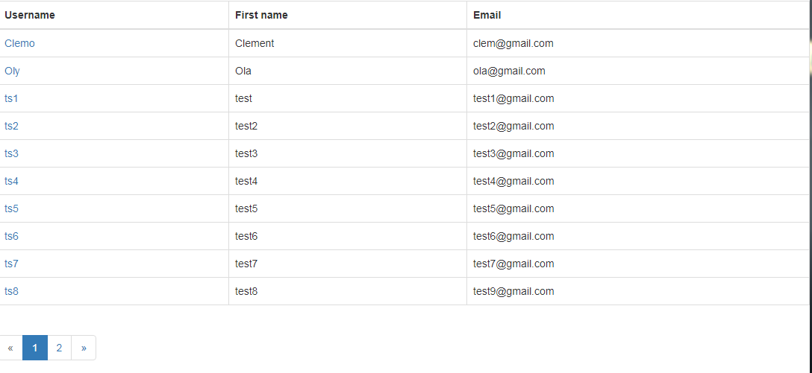

# Django Pagination

## Description

This is a simple wepapp that shows how to use pagination in django framework

## Run

After downloading this projects, go to the directory of this projects
and run the following command
(make sure you have python and [django](https://www.djangoproject.com/) installed on your machine)

```bash
    python manage.py runserver
```

## Output


